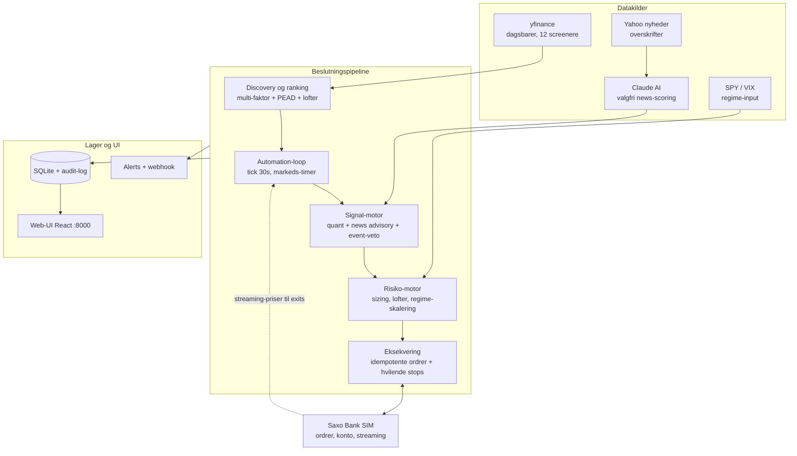

# Arkitektur

Platformen er én FastAPI-proces (port 8000) der serverer både API og web-UI.
Diagrammet viser dataflowet; matematikken bag hver komponent står nedenfor.



Nøglepointer:

- **yfinance** (~15 min forsinket) driver discovery/strategier på dagsbarer;
  **Saxo streaming** (real-time) driver exits — forsinkede priser afgør aldrig et salg.
- **Risiko-motoren er den eneste vej til en handel** — den kan kun skrumpe eller
  afvise, aldrig udvide.
- Reconciliation kører hvert tick og annullerer forældreløse ordrer hos Saxo.
- Persistens: `trading.db` (SQLite), `settings_override.json` (Setup-valg),
  `saxo_oauth.json` (OAuth-session) — alle git-ignored.

---

# Matematikken

## 1. Multi-faktor-ranking (discovery)

Hver kandidat scores 0–100 ud fra fire faktorer (alle klippet til [-1, 1]):

```
mom_c   = clip( mom_12_1 / 0.30 )          # 12-1-momentum: 1 års afkast MINUS sidste måned
trend_c = clip( (SMA20-SMA50)/SMA50 / 0.05 )
rev_c   = -clip( (ret_5d - 0.10) / 0.10, 0, 1 )   # STRAF for >10% 5-dages run-up
vol_c   = clip( (0.35 - ann_vol) / 0.25 )   # ann_vol = std(60d afkast) * sqrt(252)

score = clip( 50 + 50 * (0.40*mom_c + 0.25*trend_c + 0.20*rev_c + 0.15*vol_c), 0, 100 )
```

Justeringer efter scoring:
- **PEAD**: earnings-beat > 2 % inden for 45 dage → +5; miss < −2 % → −8 (asymmetrisk).
- **Sektorloft**: max `ceil(N * 0.30)` navne pr. sektor.
- **Korrelationsloft**: kandidat afvises hvis `corr(r_i, r_valgt) > 0.70` (60d afkast).

## 2. Position-sizing (risiko-motoren)

Tre uafhængige lofter — det mindste vinder:

```
stop      = P - 2 * ATR(14)                       # volatilitets-adaptivt stop
qty_risk  = (0.005 * E) / (P - stop)              # 0,5 % af egenkapital i risiko til stop
qty_pos   = (0.15 * E) / P                        # max 15 % pr. position
budget    = regime_scale * dd_scale * 0.95 * E - investeret
qty_budget= budget / P

qty = floor( min(qty_risk, qty_pos, qty_budget) )
```

Regneeksempel (E = 950.000, P = 100, ATR = 3):
stop = 94 → qty_risk = 4.750/6 = **791 stk** (≈ 79.100 kr, 8,3 % af konto).
Rammes stoppet, tabes 791 × 6 ≈ 4.750 kr = præcis 0,5 % af egenkapitalen —
uanset om aktien er rolig eller vild (ATR normaliserer).

## 3. Regime-skalering og drawdown-nedskalering

```
Regime (SPY vs SMA200, 50d-slope, VIX-niveau/percentil):
  bull_quiet 1.00 | bull_volatile 0.60 | chop 0.50 | bear 0.25 | crisis 0.00 (kun exits)

Drawdown-nedskalering (gated på enforce_loss_halts):
  frac = dd / dd_limit
  dd_scale = 1.0                     hvis frac <= 0.5
  dd_scale = max(0.25, 1 - (frac-0.5)*1.5)   ellers   # 100 % af grænsen -> 25 % størrelse
```

## 4. Exits (først til mølle)

```
stop-loss    : P <= entry * (1 - 0.08)
take-profit  : P >= entry * (1 + 0.15)
trailing     : P <= peak  * (1 - 0.10)        # peak = højeste kurs siden køb
momentum-exit: strategiens eget signal (trend død), uanset P&L
+ hvilende stop-ordre HOS Saxo (StopIfTraded GTC) som backstop
```

## 5. Slippage-model (paper-broker)

```
slip = max( bps_slip, min(0.075 * ATR, 0.01 * P) )   # vol-bevidst, cap 1 %
```

## 6. Walk-forward-validering (deployment-bar)

Historikken deles i 63-bar test-vinduer (120-bar warmup); KUN out-of-sample
segmenter tælles:

```
OOS Sharpe = sqrt(252) * mean(r_oos) / std(r_oos)

Deployment-bar (ALLE skal bestå før live kapital):
  OOS Sharpe >= 0.8   ·   folds >= 3   ·   >= 50 % positive folds   ·   maxDD > -20 %
```

## 7. Beslutningsgates (signal-motoren)

```
quant_ok = quant_score > 65          # strategiens egen 0-100-score
news     = advisory (vises, blokerer ikke)   [gate-mode: news_score > threshold]
event-veto: ingen køb <= 5 dage før kendt earnings/binær event
approved = quant_ok AND bullish AND risk_approved
```
